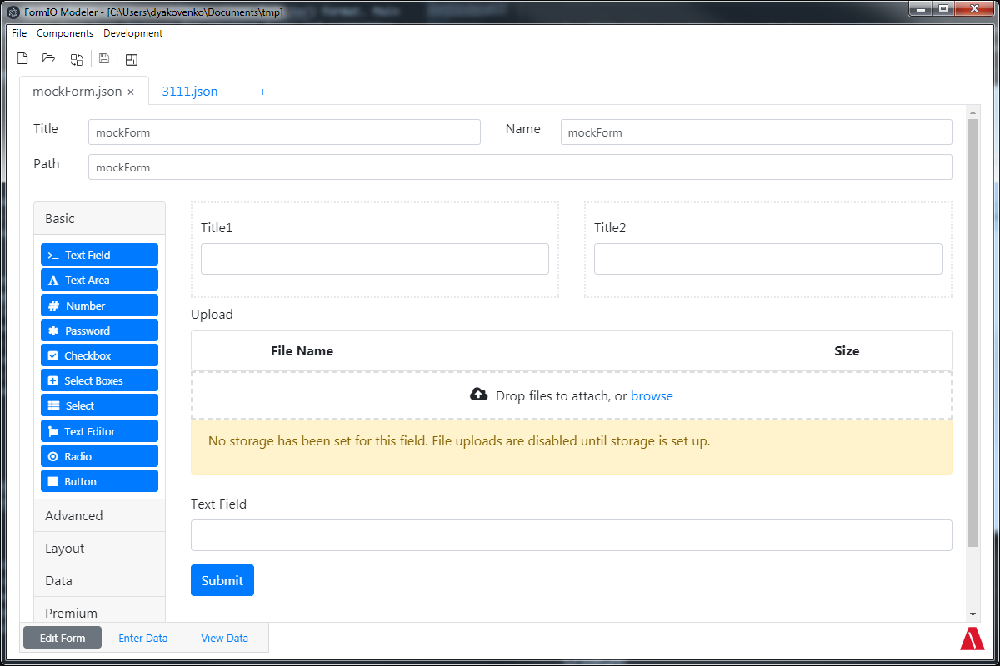

# FormiBuilder

FormBuilder is standalone designer of forms in [FormIO](https://www.form.io/) formate. Main features are: using [FormIO](https://www.form.io/) designer for creating forms and supporting custom components. FormioBuilder does not require any prerequisites installed on your computer.



# Installation

1) Download latest installer in "releases" section. 
2) Launch installer.

Application will be installed automatically to default programs folder on your computer and then launched. Shortcut will be added on you desktop.

# Usage

FormBuilder works with workspaces(directories). To save form click appropriate button in toolbar or in menu, form will be saved in workspace. File name will be the same as "path" field, separators ("\\" or "/") in path field will indicate on subfolders within workspace. 

You can register custom components, written in accordance with FormIO rules, by appropriate button in toolbar/menu. Select one or multiple custom component(s) in dialog window. They will be instantly added to form designer and saved in workspace for future using. You can add them manually creating folder "custom-components" in workspace and putting custom components there. If you add them manually you will have to restart application or reopen workspace to apply them.

# Creating custom components

### Rules/guide

* https://github.com/formio/formio.js/wiki/Custom-Components-API
* https://formio.github.io/formio.js/app/examples/customcomponent.html

### Requirements

* You must use commonjs module style.
* When importing formiojs modules you must import them as default 
```js
const Component = require('formiojs/components/_classes/component/Component').default;
```
* If you use third party libraries you must bundle they and your component in one file
* You must not include formiojs into you bundle

### Example of webpack-config for bundling third party libraries via webpack

```js
const path = require('path');

module.exports = {
    entry: './TextEditor.js',
    output: {
        path: path.resolve(__dirname, './testDist'),
        filename: 'texteditor.js',
        libraryTarget: 'umd',
        library: 'TextEditor',
    },
    externals: {
        formiojs: "formiojs"
    }
}
```